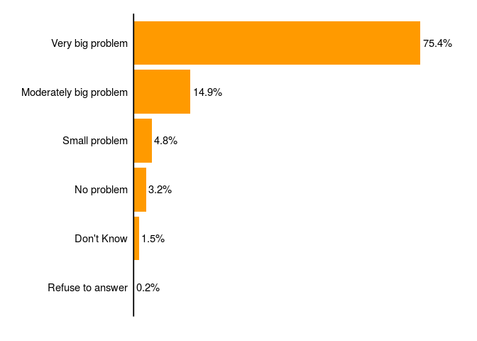
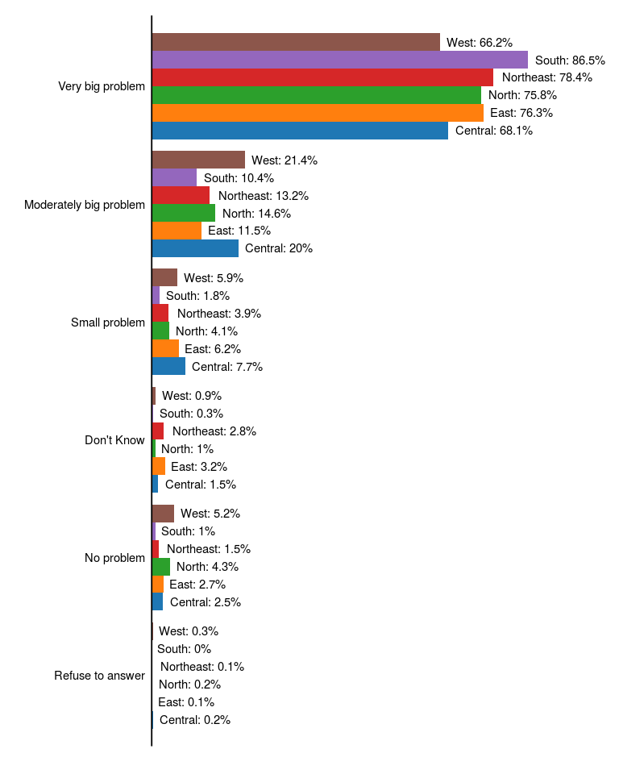
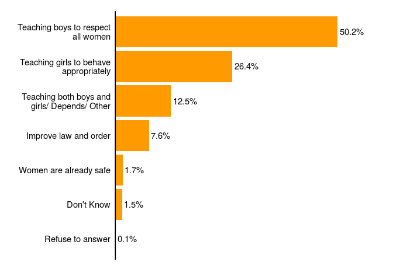
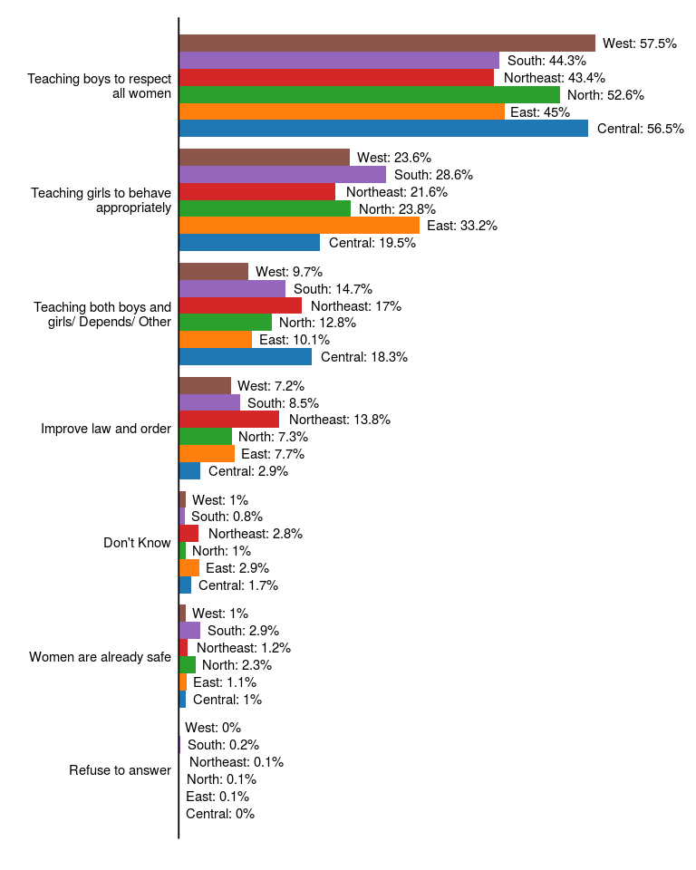
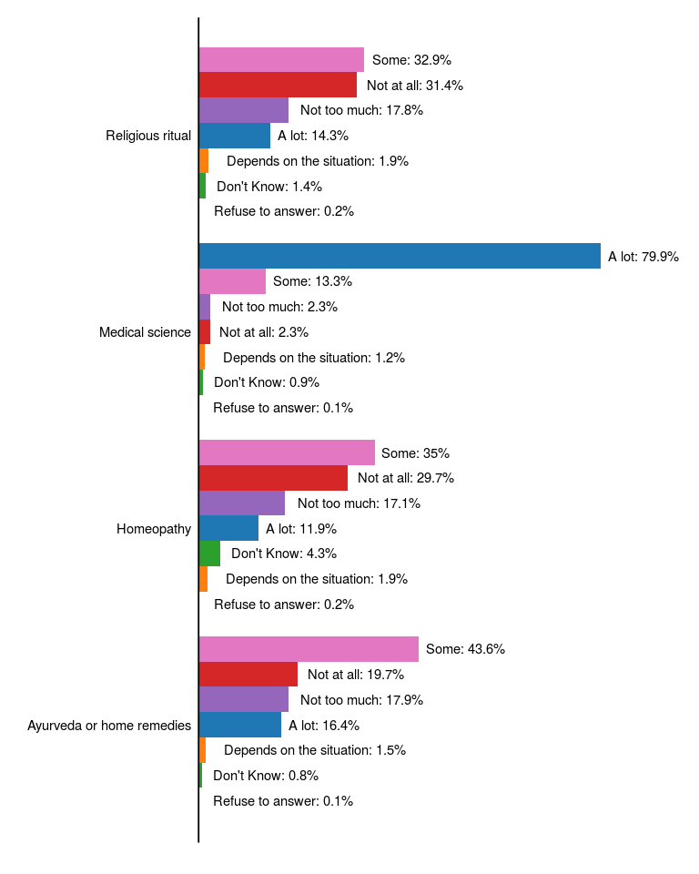

India Religion Pew Survey data analysis
================

This notebook is my continuing effort on analyzing the Pew Survey Data
conducted through November 2019 to March 2020. The main theme of the
survey was Religion in India: Tolerance and Segregation. I would be
working on this data as an when I come up with some hypothesis, and try
to test it with this data. The data is publicly avaiable from the [Pew
Research
website](https://www.pewresearch.org/religion/dataset/india-survey-dataset/).
I would not be hosting the raw data in this repository, and would only
be presenting the analyzed result, since I am not sure about the data
sharing policy of Pew Research.

The data contains a Region variable, denoting the five regions of India
defined by the Indian zonal council. The codes with their respective
states and UT are as follows:

1.  Northeast: Arunachal Pradesh, Sikkim, Nagaland, Manipur, Mizoram,
    Tripura, Assam, and Meghalaya
2.  North: Chandigarh, Delhi, Haryana, Himachal Pradesh, Jammu and
    Kashmir, Ladakh, Punjab, and Rajasthan
3.  Central: Chhattisgarh, Madhya Pradesh, Uttar Pradesh, and
    Uttarakhand
4.  East: Bihar, Jharkhand, Odisha, and West Bengal
5.  West: Dadra and Nagar Haveli, Daman and Diu, Goa, Gujarat, and
    Maharashtra
6.  South: Andaman and Nicobar Islands, Andhra Pradesh, Karnataka,
    Kerala, Puducherry, Tamil Nadu, Telangana, Lakshadweep

I would mostly be going through the data, and trying to visualize the
data, look at patterns, and attempt to answer interesting questions.

## Women safety and issues

There are a bunch of questions regarding the safety of women and various
other issues related to women. Let’s look at them one by one.

### Violence against women

Let’s look at what is the perception of India on violence against women.
First let’s look at the national average:

<!-- -->

It seems like majority of the people do take violence against women as a
very big problem. Let’s look at region wise distribution of the
response.

<!-- -->

There seems to be some variation region wise in their perception of
violence against women in India to be a very big problem. More people
from South presumably consider this a big problem than rest of India.

Now let’s see what the population thinks could be a mitigating factor to
improve the safety of women in India. First lets look at the national
average.

<!-- -->

It seems like the half of India believes that the responsibility of
women safety is on educating the boys. Interestingly, the response
almost exactly halves at each stage, at least in the top 4 cases. Now
let’s look at the data when groupped by region.

<!-- -->

Very interestingly, about 33% people from the Eastern region thinks that
teaching girls to behave appropriately would be a mitigating factor to
improve women safety. This is more than the national average of 26.4%.
The other regions hover around that data, and interestingly the Central
region is low on focusing on girls specifically, but teaching both boys
and girls, or perhaps it is situation dependent on their case.

## Health care

Next let’s see what do people say about health care. A lot of debate
nowadays is on whether Ayurveda is a legitimate alternative to mordern
medicine. What do the people of India think about it.

<!-- -->
